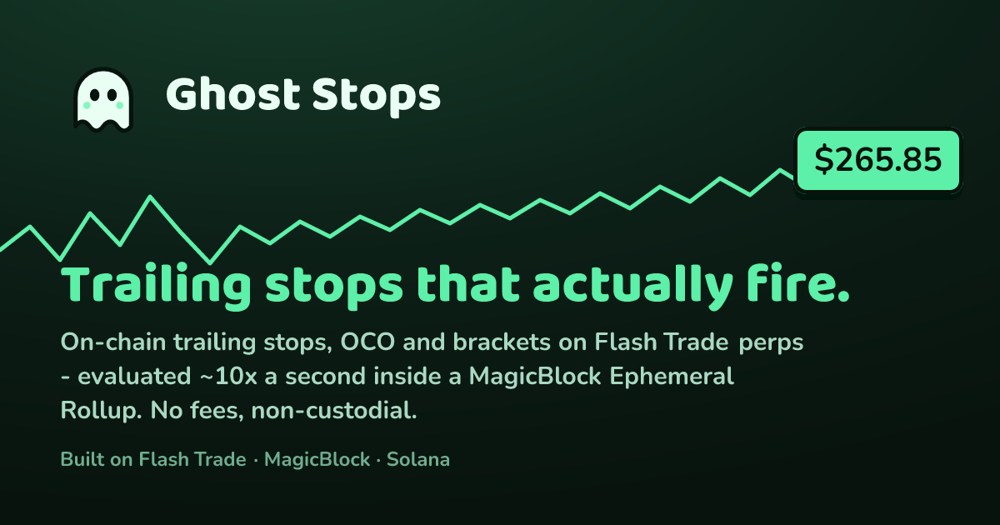

<div align="center">



# 👻 Ghost Stops

**Trailing stops, OCO, and bracket orders for Solana perps — with the trigger logic running _on-chain_, evaluated ten times a second inside a MagicBlock Ephemeral Rollup.**

No fees on the trigger. No private server holding your keys. You keep custody the whole time.

Built on [Flash Trade V2](https://docs.flash.trade) · [MagicBlock Ephemeral Rollups](https://docs.magicblock.gg) · Solana
Made for **Solana Blitz v5** (theme: Trading)

</div>

---

## The problem

Every serious trader leans on a trailing stop: _"ride the price up; if it falls 1% from its peak, close me out."_ It's the order type that lets you lock in a winner without guessing the top.

No Solana perps DEX actually has one — not Flash, not Drift, not Jupiter. And the reason is structural, not lazy:

- A trailing stop has to **recompute on every price tick** to ratchet its high-water mark.
- Writing that state to Solana L1 ten times a second would burn fees forever.

So everywhere that offers "trailing stops," the trailing actually happens on a **private server you have to trust** — a black box that watches the price, holds a key, and promises to fire. You can't inspect it, you can't verify it fired at the right price, and if it's down when the market moves, you find out the hard way.

## What Ghost Stops does

Ghost Stops moves the **trigger engine itself on-chain**, into a place where ticking 10×/sec is free:

1. **Connect your wallet → one signature enables everything.** That signature mints a MagicBlock **session key**: scoped to the Flash trading program, expiring, revocable, and _structurally unable to withdraw funds_.
2. **Open a real position on Flash Trade V2** — a live perp on mainnet, filled in ~30–50ms because Flash itself runs on an Ephemeral Rollup.
3. **Attach a trailing stop.** An on-chain **Order account** is created and delegated to MagicBlock's devnet Ephemeral Rollup.
4. **The rollup's own validator crank** calls our program's `tick` every **100ms, fee-free**, reading live **Pyth Lazer** prices and ratcheting your high-water mark _on-chain_. Every tick is a real, inspectable transaction.
5. **Price retraces past your trail → the order flips to `Fired` on-chain → the executor closes your real position** through Flash with the session key.

The decision to fire is **permissionless, deterministic, and fully on-chain.** The only off-chain step is the final "close the position" API call — and even that uses a key that can't do anything except close.

> **Two Ephemeral Rollups, one product:** ours _decides_, Flash's _executes_.

---

## How a trailing stop actually behaves

This trips people up, so it's worth being precise — it is **not** a fixed take-profit.

```
price ───▶   100   102   105   103   108   111   109   107   ⟵ retrace
HWM   ───▶   100   102   105   105   108   111   111   111   ← ratchets up, never down
stop  ───▶    99  100.9 103.9 103.9 106.9 109.9 109.9 109.9  ← trails 1% under the peak
                                                        ▲
                                          price falls to 107 → still above stop → hold
                                          ...if it hits 109.9 → FIRE, close ~+9.9%
```

- The stop **only moves up** (for a long), locking in gains as the price climbs.
- It **never caps your upside** at a fixed level — if the price keeps running, the stop keeps trailing.
- You only exit when the market **gives back your trail %** from its best point.

That's the whole appeal: it tries to capture the _maximum_ move, then bails the moment the trend reverses — without you watching a screen.

Ghost Stops also supports the other half of the order book:

| Order type | What it is |
|---|---|
| **Trailing stop** | High-water-mark ratchet described above. The flagship. |
| **Fixed trigger (TP / SL)** | Classic stop-loss or take-profit at an exact price. |
| **OCO** (one-cancels-other) | Pair a take-profit with a stop-loss; the first to fire cancels its sibling. |
| **Bracket** | An entry with both a TP and an SL attached, composed from the primitives above. |

All four are the same on-chain `Order` primitive (`trailing` + `fixed` kinds linked by an `oco_link`), evaluated by the same crank.

---

## Why the Ephemeral Rollup is load-bearing (not a checkbox)

Ghost Stops isn't "a normal app that happens to touch an ER." Remove the ER and the product doesn't exist — the entire trailing engine lives there.

| MagicBlock primitive | How Ghost Stops uses it |
|---|---|
| **Delegation lifecycle** | Order PDAs are delegated to the ER (`delegate_order`), mutated at rollup speed, and committed back to L1. |
| **Validator cranks** (`schedule_tick`) | The rollup itself evaluates every order at 100ms — **fee = 0, paid by the validator** — so there is no keeper to run or trust. _Verified: 10/10 ticks at ~100ms cadence._ |
| **Pricing oracle** | Pyth Lazer prices are pushed live into the ER as `PriceUpdateV3` accounts; `tick` reads them in-process. _Verified identical to Flash's mainnet mark to the 8th decimal._ |
| **Session keys** (`SessionTokenV2`) | One approval lets the executor _trade_ but **not withdraw** — withdrawal endpoints reject session signing. _Verified on every trading endpoint._ |
| **Flash V2's own ER** | The execution leg: fills confirm on `flash.magicblock.xyz` in ~450–650ms. |

---

## The terminal

The front end is a full trading terminal in a custom **"Money Gummy"** design system — chunky rounded cards, a ghost mascot, a dark-green theme — not a barebones demo.

- **14 live markets** — SOL, BTC, ETH, BNB, XRP, SUI, HYPE, NEAR, ADA, TRX, TON, TAO, ZEC, ONDO — every one with a verified on-chain oracle feed (the [`discover-feeds`](scripts/discover-feeds.ts) script derives and price-checks each PDA against Flash's mainnet mark).
- **Real-time chart** driven by the **same ER oracle feed your stop reads**, over a WebSocket account subscription — so the line you watch and the price that triggers you are the _exact same number_. Smooth 60fps rendering with an attached price-flag tag.
- **One-signature enable** — connect, sign once, trade. No per-trade popups.
- **Trailing-stop guardrails** — Ghost Stops computes your real liquidation price and leverage, and **warns you when your trail would sit below liquidation** (the footgun where you'd get liquidated _before_ your stop fires), suggesting a safe trail distance instead.
- **Per-coin memory** — your Protect-on/off and leverage choice are remembered per market; every token has its own shareable URL.
- **Live order tracking** — watch the high-water mark ratchet, the stop level move, and the on-chain tick counter climb in real time, with toast notifications when trades open, close, or fire.
- **History with filters** — both account activity and your stops history, filterable; PnL shown in both dollars and %.
- **Mobile-first** — the trade ticket becomes a centered modal; the whole layout reflows for phones.

---

## Architecture

```
 Pyth Lazer  (50–200ms pushes)
        │
        ▼
┌─────────────────────── devnet ER · MagicBlock ───────────────────┐
│  oracle feed PDA ──read──▶ ghost_stops::tick  ◀─── validator      │
│                              │  (every 100ms, fee = 0)   crank    │
│                              ▼                                    │
│                         Order PDA  (high-water mark ratchets      │
│                              │       ON-CHAIN; state → FIRED)     │
└──────────────────────────────┼───────────────────────────────────┘
                               │  websocket (account change)
                               ▼
                     executor service ──── control API for the web app
                               │  session-signed close-position
                               ▼
┌────────────────────────── mainnet ───────────────────────────────┐
│   Flash V2 API → Flash's ER (flash.magicblock.xyz) → real fill    │
│   positions · deposits · fills — REAL FUNDS                       │
└───────────────────────────────────────────────────────────────────┘
```

The two on-chain programs never CPI into each other — MagicBlock forbids an ER from CPI-ing into a non-delegated program — so the bridge between "decide" and "execute" is an off-chain executor **by necessity**. The trigger decision stays permissionless and verifiable; execution uses the same scoped session-key model Flash itself ships.

> The trigger program runs on the **devnet** ER, where the oracle feeds carry real mainnet Pyth Lazer prices (verified 0.0000% deviation), while all money lives on **mainnet** Flash. A mainnet-ER redeploy is the same code plus rent.

---

## Repo layout

| Path | What's inside |
|---|---|
| [`programs/ghost-stops`](programs/ghost-stops) | The Anchor program. `Order` PDAs, the `tick` trailing/fixed state machine, `schedule_tick` (the crank via Magic-program CPI), delegation, and OCO links. Devnet program: `y8gjZcwDHqZ8Sz2Uziw5nxr2cWKGyAKaqtNAUJ2mKxh` |
| [`services/executor`](services/executor) | Node service that watches order accounts on the ER WebSocket; on `Fired` it places a session-signed `close-position` on Flash. Reconcile loop, idempotent cancel, HTTP control API (`/session`, `/orders`, `/orders/:pda/cancel`, `/health`). Pays all devnet rent so users never need devnet SOL. |
| [`apps/web`](apps/web) | The Next.js terminal — Money Gummy UI, one-signature enable, the 14-market trade ticket, and the live Ghost Stops panel. |
| [`packages/flash-v2`](packages/flash-v2) | Vendored, typed Flash Trade V2 client (MIT, pinned commit). |
| [`scripts`](scripts) | Live probes + integration tests: real lifecycle, session-key matrix, oracle parity, crank cadence, end-to-end fills, and the feed-discovery tool. |
| [`docs/research`](docs/research) | Verified ground truth — probe results with on-chain signatures and the design decision brief. |

---

## Run it locally

**Prerequisites:** Node 18+, a Solana wallet, and (to place real trades) a small mainnet balance — about **$12+ USDC and ~0.02 SOL**.

```bash
# install the whole workspace (web + executor + packages)
npm install

# 1. the executor — holds only scoped session keys and pays devnet rent
#    services/executor/.env:  PRIVATE_KEY=<base58 devnet-SOL-funded keypair>
npm run -w services/executor start        # or: npx tsx services/executor/src/index.ts
                                          # control API on :8787

# 2. the web app
#    apps/web/.env.local:  NEXT_PUBLIC_BASE_RPC=<your CORS-friendly RPC key>
npm run -w apps/web dev                    # http://localhost:3000
```

Then in the browser: **Connect wallet → Enable One-Click Trading** (one signature) **→ open a position → attach a trailing stop** in the Ghost Stops panel → watch the rollup tick it ten times a second.

```bash
npm test     # vitest — the TS engine is an exact integer-math mirror of the on-chain tick
```

Copy `.env.example` → `.env` (executor) and `apps/web/.env.example` → `apps/web/.env.local`; each documents every variable.

---

## Deploy

Two independent targets — the executor can't run on Vercel because it holds a keypair and runs a persistent watcher.

| Component | Where | Required env |
|---|---|---|
| `apps/web` | Vercel (root dir `apps/web`) | `NEXT_PUBLIC_BASE_RPC` (domain-restricted key), `NEXT_PUBLIC_ER_RPC`, `NEXT_PUBLIC_EXECUTOR_URL`; optional `NEXT_PUBLIC_SITE_URL` for the OG card on a custom domain |
| `services/executor` | Railway / Fly / a small VPS (any Node host) | `PRIVATE_KEY` (devnet-funded disposable wallet), `EXECUTOR_CORS_ORIGIN=https://<your-web-domain>`, optional `GHOST_*` overrides |

After both are up, point the web app's `NEXT_PUBLIC_EXECUTOR_URL` at the executor's public URL and set `EXECUTOR_CORS_ORIGIN` to your web domain.

---

## Trust model

- **Non-custodial throughout.** The executor only ever holds **session keys** — scoped to the Flash program, expiring (24h), revocable, and **rejected by every withdrawal endpoint**. The worst a fully-compromised executor can do is _close your position at market_. It can never move your funds.
- **The trigger is permissionless.** `tick` takes only the pinned oracle feed; `cancel` and `mark_executed` are gated to owner-or-executor.
- **Every fire is auditable.** A trigger is an on-chain transaction stamped with the exact price that caused it.

---

## Verified numbers

All measured on-chain and reproducible from [`docs/research/probe-results.md`](docs/research/probe-results.md):

- **Crank cadence:** 10/10 ticks at ~100ms, **fee = 0** (payer = the validator identity).
- **Oracle parity:** devnet-ER Lazer feed == Flash mainnet mark to **0.0000%**, sub-second updates.
- **Session keys:** PASS on open / place-trigger / edit-trigger / cancel-trigger / close (438–504ms ER confirms); withdrawal correctly rejected.
- **Real fills:** entry gap **−0.028%** vs oracle; round-trip open+close cost **~4 bps**.
- **End-to-end:** **841ms** (deterministic test) and **1264ms** (natural fire after 4.5 minutes of on-chain trailing) trigger→fill, on real mainnet positions — versus Flash's native keeper, which needs price to hold past a trigger for **8–10 seconds**.

---

## Honest limitations

- **14 markets**, gated to the tokens that have a verified ER oracle feed; Flash's equities/FX/commodities markets aren't pushed to the devnet ER and stay disabled until they are.
- The browser hands the session key to _our own_ executor over HTTPS so stops fire with the tab closed. A production deployment would mint the session directly against an executor-held signer (one extra co-sign round trip).
- Trigger→fill ~1s is bounded by the single off-chain hop, which MagicBlock's CPI rules make unavoidable — still ~8× faster than Flash's native trigger keeper.
- `flashapi.trade/v2` self-reports `env:"dev"`; the client is pinned to a vendored commit.
- The executor control API authenticates `/session` registration by on-chain session existence and only acts on registered owners; a production build would add per-request signed-nonce auth and locked-down CORS on top.

---

<div align="center">

Built in a weekend on **MagicBlock Ephemeral Rollups** · **Flash Trade V2** · Anchor 0.32 · Next.js 15 · React 19

_The trailing stops Solana perps never had — finally on-chain._

</div>
